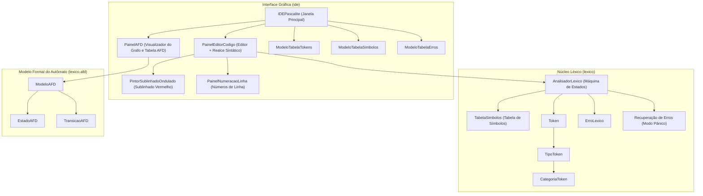

# Relatório Técnico: Analisador Léxico e IDE para o Dialeto PascaLite

**Universidade Federal do Espírito Santo (UFES)**  
**Departamento de Informática – Ciência da Computação**  
**Disciplina:** Compiladores  
**Professor:** Rodrigo Freitas Silva  
**Nome da Linguagem:** PascaLite  

---

## 1. Identificação e Nome da Linguagem

A linguagem de programação desenvolvida para este trabalho é denominada **PascaLite** (dialeto simplificado e modernizado da linguagem Pascal especificado para a disciplina de Compiladores da UFES). O dialeto preserva a clareza e estrutura de blocos clássica de Pascal, com suporte a tipagem estática, sub-rotinas (procedimentos e funções), estruturas condicionais e de repetição, além de pontuação e operadores convencionais.


---

## 2. Diagrama de Módulos da Arquitetura do Compilador

O projeto foi estruturado com uma arquitetura modular, limpa e orientada a objetos:



### Descrição dos Módulos em PT-BR:
1. **Pacote `br.ufes.compiladores.pascalite.lexico`**:
   - `AnalisadorLexico`: Motor de análise léxica que consome o código fonte como fluxo de caracteres, implementando o autômato determinístico, supressão de comentários e espaços, identificação de tokens e detecção/recuperação de erros léxicos.
   - `TipoToken`: Enumeração tipada em português com todos os tokens formais do dialeto (`PR_PROGRAM`, `PR_VAR`, `IDENTIFICADOR`, `NUMERO_INTEIRO`, etc.).
   - `CategoriaToken`: Classificação semântica dos tokens (`PALAVRA_RESERVADA`, `IDENTIFICADOR`, `LITERAL_NUMERICO`, etc.).
   - `Token`: Representação do token produzido, contendo lexema, linha, coluna, índices absolutos no texto e atributos semânticos (ex.: valor `Long`, `Double`, `String`).
   - `TabelaSimbolos`: Gerenciador da tabela de símbolos, pré-populada com palavras reservadas, operadores e pontuação, acumulando dinamicamente identificadores definidos pelo usuário no programa objeto.
   - `EntradaSimbolo`: Metadados de cada símbolo (lexema, chave canônica, categoria, origem pré-definida ou programa objeto, quantidade de ocorrências e linhas em que aparece).
   - `ErroLexico`: Estrutura de registro de erros léxicos, contendo linha, coluna, lexema ofensivo, mensagem explicativa e descrição da estratégia de recuperação empregada.
2. **Pacote `br.ufes.compiladores.pascalite.lexico.afd`**:
   - `ModeloAFD`, `EstadoAFD`, `TransicaoAFD`: Modela formalmente a 5-tupla $M = (Q, \Sigma, \delta, q_0, F)$ do Autômato Finito Determinístico, fornecendo a base para a documentação e para a renderização gráfica interativa na IDE.
3. **Pacote `br.ufes.compiladores.pascalite.ide`**:
   - `IDEPascalite`: Janela central Swing com menus, botões rápidos, split vertical, console integrado e abas de inspeção.
   - `PainelEditorCodigo`: Editor com documento estilizado, syntax highlighting colorido, listener em tempo real com *debounce* e rastreamento de cursor.
   - `PintorSublinhadoOndulado`: Pintor gráfico que desenha o sublinhado ondulado vermelho (*red squiggly line*) sob cada erro léxico detectado.
   - `PainelNumeracaoLinha`: Barra lateral de numeração de linhas sincronizada com scroll e edição.
   - `PainelAFD`: Visualizador gráfico do autômato via Java 2D e tabela completa de transições.
   - `modelos`: Modelos de tabela Swing (`ModeloTabelaTokens`, `ModeloTabelaSimbolos`, `ModeloTabelaErros`).
4. **Classe `Principal`**:
   - Ponto de entrada único: executa a IDE gráfica sem parâmetros ou o analisador em modo console (CLI) quando recebe um arquivo fonte como argumento.

---

## 3. Tabela de Tokens, Lexemas, Expressões Regulares, Atributos e Valores

Abaixo é apresentada a tabela exaustiva dos tokens do dialeto PascaLite conforme a gramática do **Anexo I** e requisitos do trabalho:

| Nome do Token | Categoria Semântica | Expressão Regular (Regex) | Lexemas de Exemplo | Atributo / Valor Retornado |
| :--- | :--- | :--- | :--- | :--- |
| `PR_PROGRAM` | Palavra Reservada | `(?i)PROGRAM` | `PROGRAM`, `program`, `Program` | Lexema normalizado ("PROGRAM") |
| `PR_BEGIN` | Palavra Reservada | `(?i)BEGIN` | `BEGIN`, `begin` | Lexema normalizado ("BEGIN") |
| `PR_END` | Palavra Reservada | `(?i)END` | `END`, `end` | Lexema normalizado ("END") |
| `PR_CONST` | Palavra Reservada | `(?i)CONST` | `CONST`, `const` | Lexema normalizado ("CONST") |
| `PR_VAR` | Palavra Reservada | `(?i)VAR` | `VAR`, `var` | Lexema normalizado ("VAR") |
| `PR_INTEGER` | Palavra Reservada | `(?i)INTEGER` | `INTEGER`, `integer` | Lexema normalizado ("INTEGER") |
| `PR_REAL` | Palavra Reservada | `(?i)REAL` | `REAL`, `real` | Lexema normalizado ("REAL") |
| `PR_CHAR` | Palavra Reservada | `(?i)CHAR` | `CHAR`, `char` | Lexema normalizado ("CHAR") |
| `PR_STRING` | Palavra Reservada | `(?i)STRING` | `STRING`, `string` | Lexema normalizado ("STRING") |
| `PR_PROCEDURE` | Palavra Reservada | `(?i)PROCEDURE` | `PROCEDURE`, `procedure` | Lexema normalizado ("PROCEDURE") |
| `PR_FUNCTION` | Palavra Reservada | `(?i)FUNCTION` | `FUNCTION`, `function` | Lexema normalizado ("FUNCTION") |
| `PR_IF` | Palavra Reservada | `(?i)IF` | `IF`, `if` | Lexema normalizado ("IF") |
| `PR_THEN` | Palavra Reservada | `(?i)THEN` | `THEN`, `then` | Lexema normalizado ("THEN") |
| `PR_ELSE` | Palavra Reservada | `(?i)ELSE` | `ELSE`, `else` | Lexema normalizado ("ELSE") |
| `PR_WHILE` | Palavra Reservada | `(?i)WHILE` | `WHILE`, `while` | Lexema normalizado ("WHILE") |
| `PR_DO` | Palavra Reservada | `(?i)DO` | `DO`, `do` | Lexema normalizado ("DO") |
| `PR_REPEAT` | Palavra Reservada | `(?i)REPEAT` | `REPEAT`, `repeat` | Lexema normalizado ("REPEAT") |
| `PR_UNTIL` | Palavra Reservada | `(?i)UNTIL` | `UNTIL`, `until` | Lexema normalizado ("UNTIL") |
| `PR_BREAK` | Palavra Reservada | `(?i)BREAK` | `BREAK`, `break` | Lexema normalizado ("BREAK") |
| `PR_CONTINUE` | Palavra Reservada | `(?i)CONTINUE` | `CONTINUE`, `continue` | Lexema normalizado ("CONTINUE") |
| `PR_OU` | Operador Lógico | `(?i)OU` | `OU`, `ou` | Lexema normalizado ("OU") |
| `PR_E` | Operador Lógico | `(?i)E` | `E`, `e` | Lexema normalizado ("E") |
| `PR_FOR` | Palavra Reservada | `(?i)FOR` | `FOR`, `for` | Lexema normalizado ("FOR") |
| `PR_TO` | Palavra Reservada | `(?i)TO` | `TO`, `to` | Lexema normalizado ("TO") |
| `PR_DOWNTO` | Palavra Reservada | `(?i)DOWNTO` | `DOWNTO`, `downto` | Lexema normalizado ("DOWNTO") |
| `PR_RECORD` | Palavra Reservada | `(?i)RECORD` | `RECORD`, `record` | Lexema normalizado ("RECORD") |
| `PR_ENUM` | Palavra Reservada | `(?i)ENUM` | `ENUM`, `enum` | Lexema normalizado ("ENUM") |
| `PR_TYPE` | Palavra Reservada | `(?i)TYPE` | `TYPE`, `type` | Lexema normalizado ("TYPE") |
| `PR_OF` | Palavra Reservada | `(?i)OF` | `OF`, `of` | Lexema normalizado ("OF") |
| `IDENTIFICADOR` | Identificador | `[A-Za-z][A-Za-z0-9_]{0,14}` | `x`, `contador`, `total_1` | Nome canônico em maiúsculas (limite: 15 caracteres) |
| `NUMERO_INTEIRO` | Literal Numérico | `[0-9]+` | `0`, `42`, `2026` | Instância de `Long` com o valor numérico |
| `NUMERO_REAL` | Literal Numérico | `[0-9]+\.[0-9]+` | `3.14`, `0.75`, `100.0` | Instância de `Double` com o valor numérico |
| `LITERAL_TEXTO` | Literal de Texto | `'([^'\r\n]\|'')*'` | `'Olá Mundo'`, `'Pascal''s'` | `String` desescapada sem as aspas delimitadoras |
| `OP_ATRIBUICAO` | Operador de Atribuição | `:=` | `:=` | `null` |
| `OP_SOMA` | Operador Aritmético | `\+` | `+` | `null` |
| `OP_SUBTRACAO` | Operador Aritmético | `-` | `-` | `null` |
| `OP_MULTIPLICACAO` | Operador Aritmético | `\*` | `*` | `null` |
| `OP_DIVISAO` | Operador Aritmético | `/` | `/` | `null` |
| `OP_IGUAL` | Operador Relacional | `=` | `=` | `null` |
| `OP_DIFERENTE` | Operador Relacional | `<>` | `<>` | `null` |
| `OP_MENOR` | Operador Relacional | `<` | `<` | `null` |
| `OP_MENOR_IGUAL` | Operador Relacional | `<=` | `<=` | `null` |
| `OP_MAIOR` | Operador Relacional | `>` | `>` | `null` |
| `OP_MAIOR_IGUAL` | Operador Relacional | `>=` | `>=` | `null` |
| `PONTO_E_VIRGULA` | Delimitador | `;` | `;` | `null` |
| `VIRGULA` | Delimitador | `,` | `,` | `null` |
| `DOIS_PONTOS` | Delimitador | `:` | `:` | `null` |
| `PONTO_FINAL` | Delimitador | `\.` | `.` | `null` |
| `ABRE_PARENTESES` | Delimitador | `\(` | `(` | `null` |
| `FECHA_PARENTESES` | Delimitador | `\)` | `)` | `null` |
| `ABRE_COLCHETES` | Delimitador | `\[` | `[` | `null` |
| `FECHA_COLCHETES` | Delimitador | `\]` | `]` | `null` |
| `COMENTARIO` | Comentário (removido) | `//.*\|\{[^}]*\}\|\(\*([^*]\|\*[^)])*\*\)` | `// linha`, `{ bloco }`, `(* bloco *)` | Descartado pelo compilador |
| `FIM_DE_ARQUIVO` | Fim de Arquivo | `$ (fim da entrada)` | `""` | `null` |

---

## 4. Autômato Finito Determinístico (AFD)

O analisador léxico opera formalmente segundo a 5-tupla:
$$M = (Q, \Sigma, \delta, q_0, F)$$

Onde:
- **$Q$ (Conjunto de Estados):**
  $$\{ q_0, q_{id}, q_{int}, q_{ponto\_num}, q_{real}, q_{str}, q_{str\_aspa}, q_{dois\_pontos}, q_{atribuicao}, q_{menor}, q_{menor\_igual}, q_{diferente}, q_{maior}, q_{maior\_igual}, q_{igual}, q_{soma}, q_{sub}, q_{mult}, q_{barra}, q_{com\_linha}, q_{com\_chaves}, q_{fim\_chaves}, q_{abre\_par}, q_{com\_parest}, q_{com\_partalvez}, q_{fim\_parest}, q_{fecha\_par}, q_{abre\_col}, q_{fecha\_col}, q_{pt\_virgula}, q_{virgula}, q_{ponto}, q_{erro} \}$$
- **$\Sigma$ (Alfabeto):**
  $$\{ a..z, A..Z, 0..9, \_, +, -, *, /, :, =, <, >, ;, ,, ., (, ), [, ], ', \text{espaço}, \backslash t, \backslash r, \backslash n, \text{símbolos imprimíveis} \}$$
- **$q_0$ (Estado Inicial):** $q_0$
- **$F$ (Conjunto de Estados Finais de Aceitação):**
  $$\{ q_{id}, q_{int}, q_{real}, q_{str\_aspa}, q_{dois\_pontos}, q_{atribuicao}, q_{menor}, q_{menor\_igual}, q_{diferente}, q_{maior}, q_{maior\_igual}, q_{igual}, q_{soma}, q_{sub}, q_{mult}, q_{barra}, q_{com\_linha}, q_{fim\_chaves}, q_{fim\_parest}, q_{abre\_par}, q_{fecha\_par}, q_{abre\_col}, q_{fecha\_col}, q_{pt\_virgula}, q_{virgula}, q_{ponto}, q_{erro} \}$$

---

## 5. Estratégia de Recuperação de Erros (Modo Pânico)

O requisito **j)** exige a escolha de pelo menos uma estratégia de recuperação de erros léxicos. Foi implementada a estratégia de **Modo Pânico com Sincronização por Delimitador e Descarte Controlado**:

1. **Detecção e Registro Completo:**  
   Quando uma sequência anômala ou caractere inválido é encontrado, um objeto `ErroLexico` é criado contendo linha, coluna, índice exato, comprimento, lexema ofensivo e mensagem detalhada.
2. **Descarte e Sincronização:**  
   - Para caracteres especiais proscritos (como `$`, `#`, `@`, `!`, `?` fora de literais): o compilador descarta o caractere inválido e continua a varredura a partir do caractere subsequente.
   - Para literais de texto não fechados antes de `\n`: o compilador sintetiza o fechamento da string na quebra de linha, registrando o erro e prosseguindo para a linha seguinte.
   - Para números malformados (ex.: `42.abc` ou `99nomes`): o analisador consome o lexema até o próximo caractere separador (espaço em branco, pontuação ou operador), impedindo leituras corruptas em cascata.
   - Para identificadores que excedem 15 caracteres: o erro é reportado explicitamente com o tamanho real, mas o identificador é registrado na tabela de modo a permitir que o restante do programa seja analisado normalmente.
3. **Não Interrupção:**  
   A compilação não para no primeiro erro; todos os erros presentes no arquivo são catalogados e destacados graficamente simultaneamente.

---

## 6. Recursos da IDE Desenvolvida

A IDE foi desenvolvida em **Java Swing** nativo, sem dependências externas complexas, garantindo execução imediata em qualquer ambiente Java 21:

1. **Editor de Código Moderno:**
   - Numeração de linhas dinâmica e alinhada (`PainelNumeracaoLinha`).
   - **Realce Sintático Colorido:** Palavras reservadas em azul, literais de texto em laranja, números em verde claro, comentários em cinza itálico e operadores em amarelo.
   - **Sublinhado Ondulado Vermelho em Tempo Real (*On-The-Fly*):** Enquanto o usuário digita, uma rotina com temporizador de *debounce* (250 ms) reavalia o código e sublinha de imediato os trechos com erro (`PintorSublinhadoOndulado`).
2. **Tabela de Erros Léxicos Interativa:**
   - Exibe linha, coluna, trecho com erro, mensagem e estratégia de recuperação.
   - **Salto por duplo-clique:** Clicar duas vezes em qualquer linha da tabela de erros move o cursor e seleciona exatamente o trecho com erro no editor!
3. **Visualizador do Fluxo de Tokens:**
   - Lista sequencial de todos os tokens gerados com numeração, linha, coluna, categoria, tipo, lexema e valor convertido (`ModeloTabelaTokens`).
4. **Tabela de Símbolos Completa:**
   - Apresenta símbolos pré-definidos (palavras reservadas, operadores, pontuações) e símbolos dinâmicos do programa (identificadores), contabilizando o total de ocorrências e todas as linhas onde foram referenciados (`ModeloTabelaSimbolos`).
5. **Aba do Autômato Finito (AFD):**
   - Renderizador gráfico Java 2D do diagrama de estados e transições (`PainelAFD`).
   - Tabela formal de transições $\delta(q, a)$ acessível na mesma aba.
6. **Console de Compilação:**
   - Log completo da compilação com estatísticas de tempo, caracteres e contagem de tokens/erros.
7. **Menu de Exemplos Prontos:**
   - Permite carregar com um clique programas de exemplo válidos, com erros, fatorial e bônus.

---

## 7. Como Executar

### Pré-requisitos:
- Java JDK 21 ou superior instalado.

### Executando a IDE Gráfica:
- Pelo script Windows: dê duplo-clique em `executar_ide.bat`.
- Ou pelo terminal PowerShell / CMD:
  ```powershell
  java -jar pascalite.jar
  ```

### Executando em Linha de Comando (CLI):
Para validar arquivos diretamente pelo terminal:
```powershell
java -jar pascalite.jar exemplos\exemplo_valido.pas
java -jar pascalite.jar exemplos\exemplo_com_erros.pas
java -jar pascalite.jar exemplos\fatorial.pas
java -jar pascalite.jar exemplos\exemplo_bonus.pas
```

### Recompilando o Projeto:
Caso realize alterações no código fonte Java:
```powershell
.\compilar.bat
```
